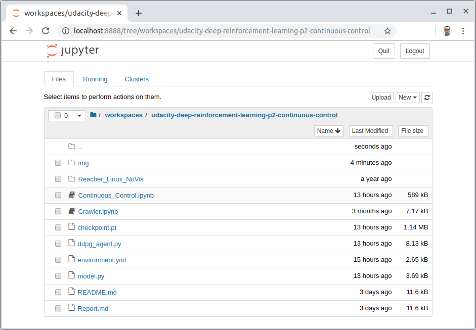
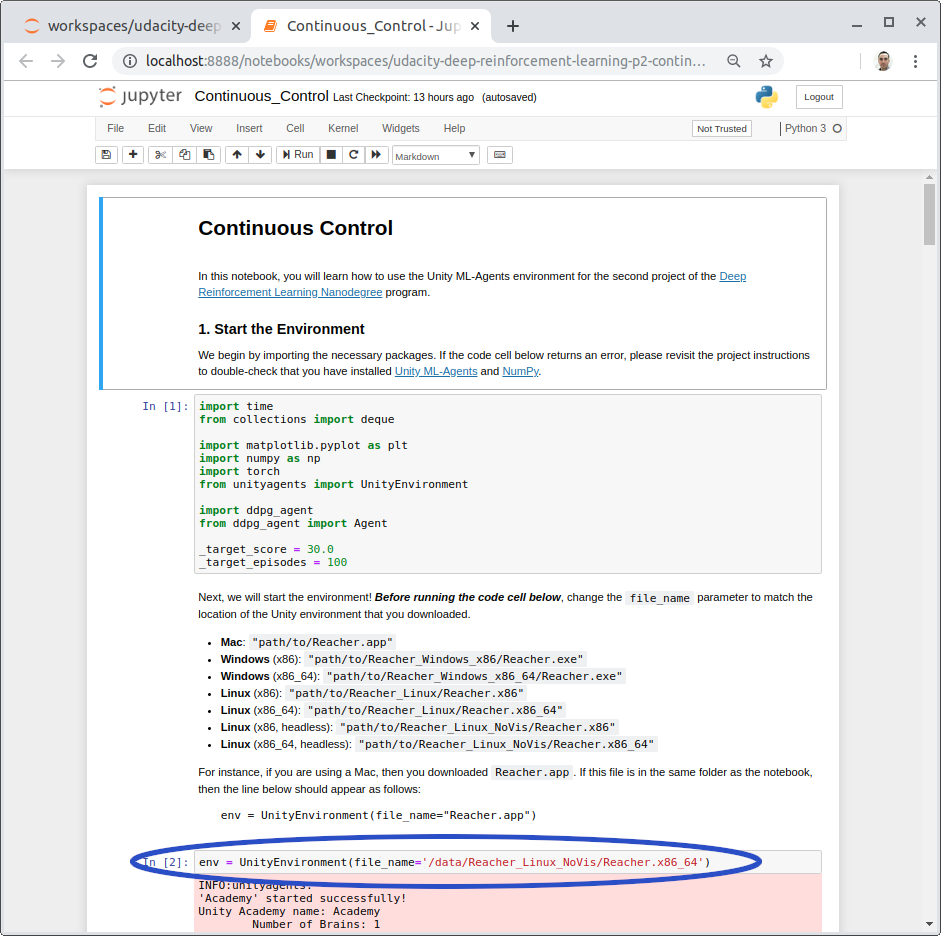
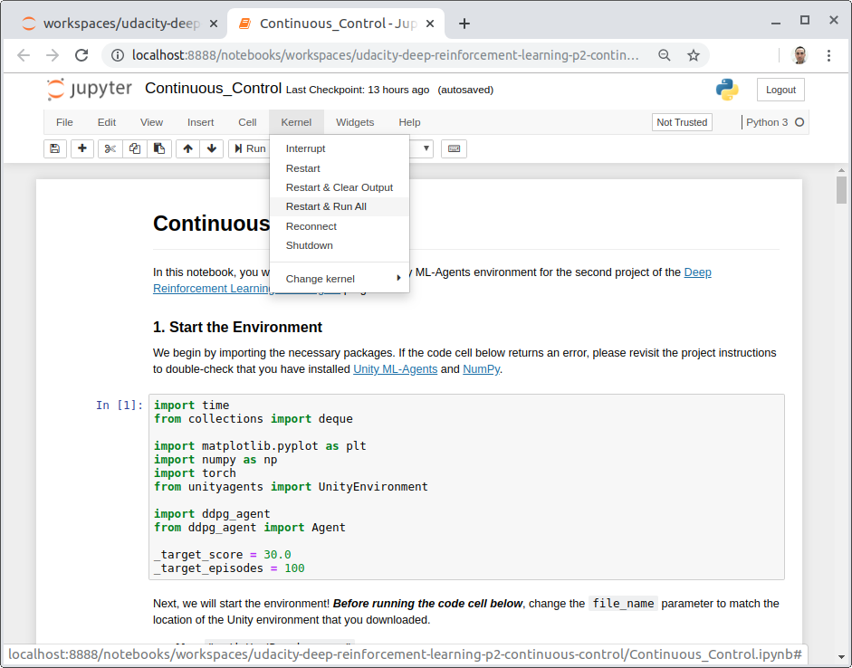

# Project 2: Continuous Control

## Introduction
This project is part of the [Deep Reinforcement Learning Nanodegree Program](https://www.udacity.com/course/deep-reinforcement-learning-nanodegree--nd893), by Udacity.  

The goal of this project is to create and train a double-jointed arm agent that is able to maintain its hand in contact with a moving target for as many time steps as possible.  


## Understanding the environment

This environment has been built using the **Unity Machine Learning Agents Toolkit (ML-Agents)**, which is an open-source Unity plugin that enables games and simulations to serve as environments for training intelligent agents. You can read more about ML-Agents by perusing this [GitHub repository](https://github.com/Unity-Technologies/ml-agents).  

The project environment provided by Udacity is similar to, but not identical to the Reacher environment on the [Unity ML-Agents GitHub page](https://github.com/Unity-Technologies/ml-agents/blob/master/docs/Learning-Environment-Examples.md#reacher).  

In this environment, a double-jointed arm can move to target locations. A reward of **+0.1** is provided for each step that the agent's hand is in the goal location.  
Thus, the goal of the agent is to maintain its position at the target location for as many time steps as possible.


#### State and action spaces
The observation space consists of **33 variables** corresponding to position, rotation, velocity, and angular velocities of the arm.  

Each action is **a vector with four numbers**, corresponding to torque applicable to two joints. Every entry in the action vector should be a number **between -1 and 1**.


#### Solving the environment

There are two versions of the environment.

* **Version 1: One (1) Agent**  
The task is episodic, and in order to solve the environment, the agent must get an **average score of +30 over 100 consecutive episodes**.

* **Version 2: Twenty (20) Agents**  
The barrier to solving the second version of the environment is slightly different, to take into account the presence of many agents. In particular, the agents must get an average score of +30 (over 100 consecutive episodes, and over all agents). Specifically,
 * After each episode, we add up the rewards that each agent received (without discounting), to get a score for each agent. That yields 20 (potentially different) scores. We then take the average of these 20 scores.  
 * That yields an average score for each episode (where the average is over all 20 agents).  
 * The environment is considered solved, when the **moving average over 100 episodes** of those average scores **is at least +30**.


## Included in this repository

* The code used to create and train the Agent
  * Continuous_Control.ipynb
  * ddpg_agent.py
  * model.py
* The trained model
  * checkpoint.pt
* A file describing all the packages required to set up the environment
  * environment.yml
* A Report.md file describing the development process and the learning algorithm, along with ideas for future work
* This README.md file


## Setting up the environment

This section describes how to get the code for this project, configure the local environment, and download the Unity environment with the Agents.

### Getting the code
You have two options to get the code contained in this repository:
##### Option 1. Download it as a zip file

* [Click here](https://github.com/silviomori/udacity-deep-reinforcement-learning-p2-continuous-control/archive/master.zip) to download all the content of this repository as a zip file
* Decompress the downloaded file into a folder of your choice

##### Option 2. Clone this repository using Git version control system
If you are not sure about having Git installed in your system, run the following command to verify that:

```
$ git --version
```
If you need to install it, follow [this link](https://git-scm.com/downloads) to do so.

Having Git installed in your system, you can clone this repository by running the following command:

```
$ git clone https://github.com/silviomori/udacity-deep-reinforcement-learning-p2-continuous-control.git
```
### Installing Miniconda
Miniconda is a free minimal installer for conda. It is a small, bootstrap version of Anaconda that includes only conda, Python, the packages they depend on, and a small number of other useful packages, including pip, zlib, and a few others.  

If you would like to know more about Anaconda, visit [this link](https://www.anaconda.com/).

In the following links, you find all the information to install **Miniconda** (*recommended*)

* Download the installer: [https://docs.conda.io/en/latest/miniconda.html](https://docs.conda.io/en/latest/miniconda.html)
* Installation Guide: [https://conda.io/projects/conda/en/latest/user-guide/install/index.html](https://conda.io/projects/conda/en/latest/user-guide/install/index.html)

Alternatively, you can install the complete Anaconda Platform

* Download the installer: [https://www.anaconda.com/distribution/](https://www.anaconda.com/distribution/)
* Installation Guide: [https://docs.anaconda.com/anaconda/install/](https://docs.anaconda.com/anaconda/install/)

### Configuring the local environment

#### Option 1: Using the environment.yml file  
The `environment.yml` file included in this repository describes all the packages required to set up the environment.  
Run the following commands to configure it.

```
$ conda create -f environment.yml  
$ conda activate drlnd-p2-control  
```

#### Option 2: Installing the packages  
If you have problems to create the environment following the steps above, alternatively you can create the environment and install the required packages by following the steps below.  

**1. Create the environment**  
  
```
$ conda create --name drlnd-p2-control python=3.6
$ conda activate drlnd-p2-control
```  

**2. Install PyTorch**  
Follow [this link](https://pytorch.org/get-started/locally) to select the right command for your system.  
Here, there are some examples which you can use, if it fit in your system:  

**a.** Linux or Windows

```
## Run this command if you have an NVIDIA graphic card and want to use it  
$ conda install pytorch cudatoolkit=10.1 -c pytorch

## Run this command, otherwise
$ conda install pytorch cpuonly -c pytorch
```  

**b.** Mac  
MacOS Binaries do not support CUDA, install from source if CUDA is needed

```
$ conda install pytorch -c pytorch  
```  


**3. Install Unity Agents**  

```
$ pip install unityagents
```  

### Download the Unity environment with the Agents  

Download the environment from one of the links below and decompress the file into your project folder.  
You need only select the environment that matches your operating system:

 * Version 1: One (1) Agent
     * Linux: [click here](https://s3-us-west-1.amazonaws.com/udacity-drlnd/P2/Reacher/one_agent/Reacher_Linux.zip)
     * Linux Headless: [click here](https://s3-us-west-1.amazonaws.com/udacity-drlnd/P2/Reacher/one_agent/Reacher_Linux_NoVis.zip)
     * Mac OSX: [click here](https://s3-us-west-1.amazonaws.com/udacity-drlnd/P2/Reacher/one_agent/Reacher.app.zip)
     * Windows (32-bit): [click here](https://s3-us-west-1.amazonaws.com/udacity-drlnd/P2/Reacher/one_agent/Reacher_Windows_x86.zip)
     * Windows (64-bit): [click here](https://s3-us-west-1.amazonaws.com/udacity-drlnd/P2/Reacher/one_agent/Reacher_Windows_x86_64.zip)
 * Version 2: Twenty (20) Agents
     * Linux: [click here](https://s3-us-west-1.amazonaws.com/udacity-drlnd/P2/Reacher/Reacher_Linux.zip)
     * Linux Headless: [click here](https://s3-us-west-1.amazonaws.com/udacity-drlnd/P2/Reacher/Reacher_Linux_NoVis.zip)
     * Mac OSX: [click here](https://s3-us-west-1.amazonaws.com/udacity-drlnd/P2/Reacher/Reacher.app.zip)
     * Windows (32-bit): [click here](https://s3-us-west-1.amazonaws.com/udacity-drlnd/P2/Reacher/Reacher_Windows_x86.zip)
     * Windows (64-bit): [click here](https://s3-us-west-1.amazonaws.com/udacity-drlnd/P2/Reacher/Reacher_Windows_x86_64.zip)     

(_For Windows users_) Check out [this link](https://support.microsoft.com/en-us/help/827218/how-to-determine-whether-a-computer-is-running-a-32-bit-version-or-64) if you need help with determining whether your computer is running a 32-bit version or 64-bit version of the Windows operating system.

(_For AWS_) If you'd like to train the agent on AWS (and have not [enabled a virtual screen](https://github.com/Unity-Technologies/ml-agents/blob/master/docs/Training-on-Amazon-Web-Service.md)), then please use [this link](https://s3-us-west-1.amazonaws.com/udacity-drlnd/P2/Reacher/one_agent/Reacher_Linux_NoVis.zip) (version 1) or [this link](https://s3-us-west-1.amazonaws.com/udacity-drlnd/P2/Reacher/Reacher_Linux_NoVis.zip) (version 2) to obtain the "headless" version of the environment.  You will **not** be able to watch the agent without enabling a virtual screen, but you will be able to train the agent.  (_To watch the agent, you should follow the instructions to [enable a virtual screen](https://github.com/Unity-Technologies/ml-agents/blob/master/docs/Training-on-Amazon-Web-Service.md), and then download the environment for the **Linux** operating system above._)


## How to train the Agent
The environment you have just set up has the files and tools that allow the training of the agent.  

Start the Jupyter Notebook server by running the commands below. A new browser tab will open with a list of the files in the current folder.

```
$ conda activate drlnd-p2-control
$ jupyter notebook
```

If you are keen to know more about notebooks and other tools of Project Jupyter, you find more information on [this website](https://jupyter.org/index.html).

Navigate to the root of the project in your system and click on the `Continuous_Control.ipynb` notebook.  
  

You must set your operational system by changing the value of the variable `file_name` in the second cell code to match the location of the Unity environment that you have downloaded.  



You can train the agent by clicking on the menu bar `Kernel` and then `Restart & Run All`.  
  


### Adjusting the Hyperparameters
To experiment with how the Agent learns through distinct parameters, you can tune these variables:  

**1.** In the **Continuous_Control.ipynb** file  

* \_target_score: How many points your agent must obtain to consider the environment solved
* \_target_episodes: How many episodes to consider when calculating the moving average
* n_episodes: Maximum number of training episodes
* max_t: Maximum number of time steps per episode
* random_seed: The number used to initialize the pseudorandom number generator

**2.** In the **ddpg_agent.py** file

* \_batch_size: Minibatch size
* \_buffer_size: Replay buffer size
* \_gamma: Discount factor for expected rewards
* \_lr_actor: Learning rate for the local actor's network
* \_lr_critic: Learning rate for the local critic's network
* \_tau: Multiplicative factor for the soft-update of the target networks's weights
* \_noise_decay: Multiplicative factor for the noise-process rate decay
* fc_layers for the actor network: Number and size of the actor network's layers
* fc_layers for the critic network: Number and size of the critic network's layers


## Uninstall
If you wish to revert all the modifies in your system, and remove all the code, dependencies and programs installed in the steps above, you will want to follow the next steps.

### Uninstall Miniconda or Anaconda
To do so, please refer to [this link](https://docs.anaconda.com/anaconda/install/uninstall/).


### Remove the code
Simply delete the entire folder containing the code you downloaded in the step "Getting the code"

