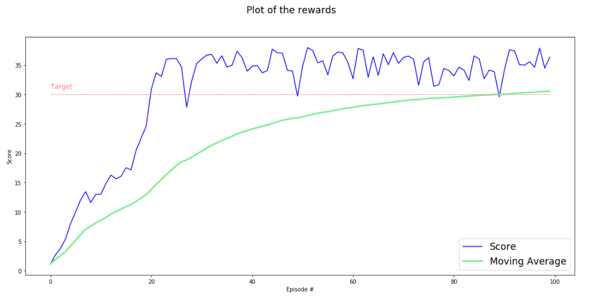
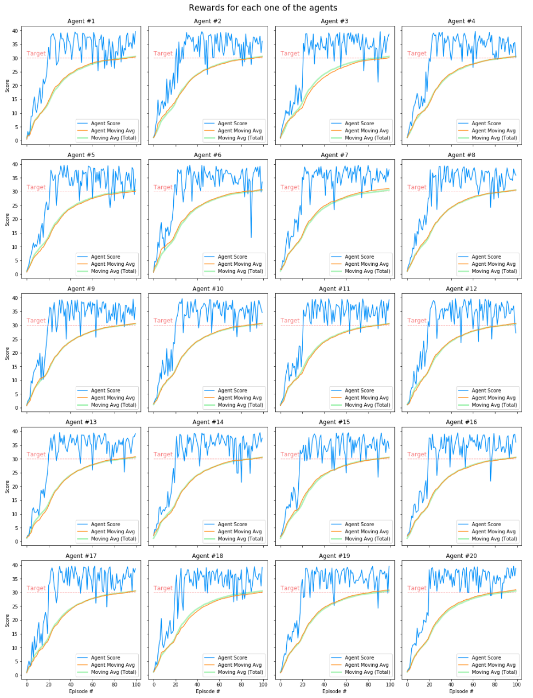
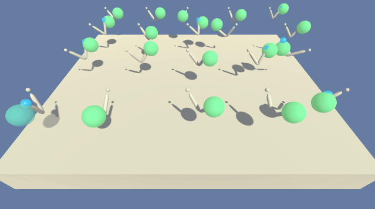

# Project 2: Continuous Control

## Description of the implementation

### Algorithm
In order to solve this challenge, I have explored and implemented the Deep Deterministic Policy Gradient algorithm (DDPG), as described in this paper: [Continuous control with deep reinforcement learning](https://arxiv.org/abs/1509.02971).

### Development

I began this project by implementing the DDPG algorithm, which combines the actor-critic approach with insights from the recent success of Deep Q-Network (DQN). Having read the original DDPG paper, I was confident this method could produce good results.  Thus, I accepted the challenge of solving this environment only using the ideas presented in this model.  

Initially, I created the Actor and Critic networks flexible enough to receive as parameter the number of hidden layers, as well as the number of nodes in each one of them. As a result of that, I could tune their depth and size easily.  

Then, I proceeded to implement the Agent with the initial purpose of solely instantiate the networks and take actions, so that I could test whether the Actor was operating correctly.  

Next, I implemented the replay buffer so as to store experiences and allow the training phase to take place.  

After that, I wrote the learning function along with the soft-update method. Having finished this step, I could certify the correctness of the whole training process.  

Before going deep into the final phase, I included an exploration noise process - the Ornstein-Uhlenbeck process - as well as some other minor adjustments, such as initializing the networks' weights.  

Finally, it was time to tweak the hyperparameters in order to solve the environment in a few episodes as possible. I carried out this phase using version 2, which works with 20 agents simultaneously. I describe this phase in more detail in the section 'Fine-tuning the hyperparameters'.  

### Network architecture  

The Actor Network receives as input 33 variables representing the observation space and generates as output 4 numbers representing the predicted best action for that observed state. That means, the Actor is used to approximate the optimal policy _π_ deterministically.

The Critic Network receives as input 33 variables representing the observation space. The result of the Critic's first hidden layer and the action proceeding from the Actor Network are stacked to be passed in as input for the Critic's second hidden layer.  
The output of this network is the prediction of the target value based on the given state and the estimated best action.  
That means the Critic calculates the optimal action-value function _Q(s, a)_ by using the Actor's best-believed action.

The following figure illustrates the network architecture.  
  

### Fine-tuning the hyperparameters
  
I tried distinct values for the networks' depth and size, such [128, 128], [128, 32], [64, 64, 64], [200, 200], but ended up with the layout suggested in the paper: two hidden layers, the first with 400 nodes and the second with 300 nodes, for both Actor and Critic networks.

The paper uses minibatches with a size of 64 and learning rates of 10^-4 and 10^-3 for the Actor and the Critic, respectively. After testing those settings and others, I opted for using minibatches with a size of 128 and learning rates of 10^-3 for both.  

Concerning the replay buffer size, after some tests, it was fixed in 10^5, which is enough to hold experiences of 5 whole episodes of 1,000 steps, considering the use of version 2 with 20 agents.  

To the discounted reward factor (gamma), the best value found was 0.99, which gives importance for around 100 rewards ahead.  

Soft-updates were performed at a rate of 10^-3 for each learning step, replacing the target networks' weights entirely after around each episode.  

As far as the exploration noise process goes, I determined the value of 0.999 for the decay rate, which practically canceled out the noise effect owing to the form of how this rate was updated.  

Summing up, these were the values defined for the hyperparameters:

* fc_layers for the actor network: FC1: 400 nodes, FC2: 300 nodes
* fc_layers for the critic network: FC1: 400 nodes, FC2: 300 nodes
* max_t: 1,000
* \_buffer_size: 10^5
* \_batch_size: 128
* \_lr_actor: 10^-3
* \_lr_critic: 10^-3
* \_gamma: 0.99
* \_tau: 10^-3
* \_noise_decay: 0.999
* \_target_score: 30.0
* \_target_episodes: 100

## Result

Having worked hard in this implementation and the training phase, I reached the best result possible for this project:  
**I solved this environment in 0 (zero) episodes!!**  

Not only did the agents hit the target score together, but also they did it individually. Note that in the last column of the table below, the lowest moving average also scored more than 30.0 points.  

### Plot of the rewards
This graph shows the rewards per episode for all agents within the training phase, as well as the moving average.  
It illustrates that the Agent was able to receive a moving average reward of at least 30.0 points over the first 100 episodes.  

  

The next graph shows the rewards per episode for each one of the 20 agents individually within the training phase, as well as their moving average.  
It illustrates that each Agent individually was able to receive a moving average reward of at least 30.0 points over the first 100 episodes.  

## Trained Agent
In the GIFs below, you can watch the trained Agent and compare it with an untrained Agent.  

**Trained Agent**  
  

**Untrained Agent**  

## Ideas for Future Work

1. Although I have spent a great deal of time tailoring the hyperparameters, there may be other sets of values that conduce the Agent to solve the environment even faster. Thus, more tests might be performed to verify that.  

2. Since the settings of this project ended up canceling out the exploration noise process, other tests might be carried out applying noise during the training phase.  

4. DDPG paper uses minibatches taken uniformly from the replay buffer. Alternatively, the prioritized replay buffer would be implemented to compare the results.  

3. Negative rewards could be introduced to discourage the Agent from taking aleatory moves away from its goal of keeping in touch with the target.  

2. The goal for this project was getting a reward of +30.0 over 100 consecutive episodes. Other tests might verify if this architecture can solve the same environment with a higher target score.  

5. There are other actor-critic algorithms proposed to solve this kind of environment. So, future works may implement them to verify their performance. Some of those algorithms are:  
   * [TRPO - Trust Region Policy Optimization](https://arxiv.org/abs/1502.05477)
   * [GAE - Generalized Advantage Estimation](https://arxiv.org/abs/1506.02438)
   * [A3C - Asynchronous Advantage Actor-Critic](https://arxiv.org/abs/1602.01783)  
   * A2C - Advantage Actor-Critic
   * [ACER - Actor Critic with Experience Replay](https://arxiv.org/abs/1611.01224)
   * [PPO - Proximal Policy Optimization](https://arxiv.org/pdf/1707.06347.pdf)
   * [D4PG - Distributed Distributional Deterministic Policy Gradients](https://arxiv.org/pdf/1804.08617.pdf)

